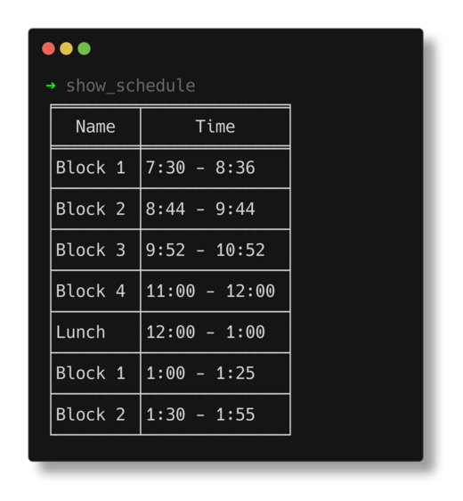

Command-line utility for displaying the SBHS remote schedule for the current day.

## Usage

```shell
$ show_schedule
show_schedule [FLAGS]

FLAGS:
    -r, --remaining    Only show blocks remaining in the day
    -h, --help         Prints help information
    -V, --version      Prints version information
```

```shell
$ show_schedule
╒════════╤══════════════╕
│  Name  │     Time     │
╞════════╪══════════════╡
│Block 1 │7:30 - 8:36   │
├────────┼──────────────┤
│Block 2 │8:44 - 9:44   │
├────────┼──────────────┤
│Block 3 │9:52 - 10:52  │
├────────┼──────────────┤
│Block 4 │11:00 - 12:00 │
├────────┼──────────────┤
│Lunch   │12:00 - 1:00  │
├────────┼──────────────┤
│Block 1 │1:00 - 1:25   │
├────────┼──────────────┤
│Block 2 │1:30 - 1:55   │
└────────┴──────────────┘
```

## Screenshot with Font Ligatures


